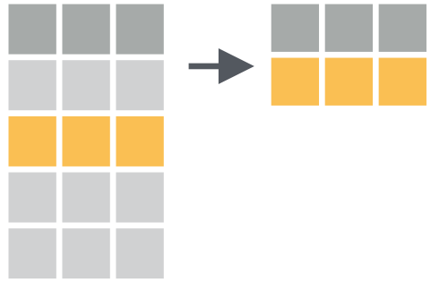

# Introducción al Uso de R para Análisis Estadístico { .center .white data-background="https://images.idgesg.net/images/article/2018/05/cw_r_guide_video_series_thinkstock_16x9_1920x1080-100758020-orig.jpg" }

```{r, include=FALSE}
knitr::opts_chunk$set(
  message = FALSE,
  warning = FALSE,
  dev = "svg",
  cache = TRUE,
  cache.path = ".cache/",
  fig.path = "static/imgs/slides/",
  fig.width = 11,
  fig.height = 5
)

library(icon)
library(jbkmisc)
library(ggplot2)

theme_pres <- theme_jbk(
  base_family = "Roboto Condensed",
  plot_margin = margin(5, 5, 5, 5)
  ) + 
  theme(legend.position = "none")

theme_set(theme_pres)
```

## ¿cómo estamos? { .center .white data-background="static/imgs/yay.gif" }

## ¿Por qué R?

- Lenguaje orientado a los datos (*)
- Flexibilidad. Lenguaje de interfaces.
- +11.000 paquetes
- Comunidad


----

Antes de partir

- Presentación http://jkunst.com/intro-r-workshop/
- Código https://github.com/jbkunst/intro-r-workshop
- Asignación: `var <- 5` significa que la variable `var` contiente el valor `5`  
- Pipe: `var %>% f()`  que a la variable `var` le aplico la función `f`. Leer como **luego**
- De la misma forma: `var %>% f() %>% g()` a `var` le aplico `f`, luego `g`

----

Antes de partir

> - Tabla, Datos tabulados o _data frame_ es un conjunto de valores cada uno asociado
a una variable y una observación


----

En general cualquier análsis(*)

 

# Importar { .center .white data-background=https://creativevibes.org/wp-content/uploads/2017/05/Start-The-Journey-Images.jpg}

----

<br><br>
 

----

Con R podemos acceder a información desde distintas fuentes:

- Archivos de texto plano: txt, csv, tsv
- Archivos MS excel, SPSS, SAS
- Base de Datos: MySQL, SQLServer, PostgreSQL
- APIs, sitios webs 

----

```{r}
library(tidyverse) # combinacion de paquetes para importar + transformar + visualizar

comunas <- read_csv("data/codigos_comunales.csv")
comunas
```

---- 

```{r}
library(haven) # SPSS SAS STATA

casen <- read_sav("data/casen/Casen 2017.sav")
casen
```

----

```{r, cache=FALSE}
library(DBI)    # Interfaz para bases de datos
library(RMySQL) # Driver para MySQL

con <- dbConnect(
  drv = MySQL(),
  dbname = "censo2017",
  host = "142.93.20.188", 
  port = 3306,
  user = "test",
  password = "HFW9KYZBnEYr!"
)

dbListTables(con)
```

----

```{r}
personas <- tbl(con,"personas")
personas
```

# Transformar { .left .white data-background="http://media-cdn.timesfreepress.com/img/photos/2016/07/25/1469464845_0727MfeatLibrary1-C_t1070_h5be62d5b4b340aded4d6baf5bd671ee4fd6571f4.jpg" }

----

<br>

<div id="left">
 
<br>
 
</div>

<div id="right">
 
<br>
 
</div>


----

<br>

<div id="left">

  <div id="left">
   
  <br>
   
  </div>
  
  <div id="right">
   
  <br>
   
  </div>

</div>

<div id="right">

  <div id="left">
   
  <br>
   
  </div>
  
  <div id="right">
   
  <br>
   
  </div>

</div>

<br><br>

<small>https://github.com/gadenbuie/tidy-animated-verbs</small>

----

```{r}
casen_comuna <- casen %>% 
  mutate(comuna = as.numeric(comuna)) %>% 
  group_by(comuna) %>% 
  summarise(ingreso_promedio_mm = mean(y1, na.rm = TRUE)/1000)
casen_comuna
```

----

```{r}
personas_resumen <- personas %>% 
  group_by(region, comuna) %>% 
  summarise(personas = n(), escolaridad_promedio = mean(ESCOLARIDAD)) %>% 
  collect()

personas_resumen
```

---- 

```{r, include=FALSE}
comunas <- comunas %>% mutate(COMUNA = as.character(COMUNA))
```

```{r}
data <- comunas %>%
  inner_join(personas_resumen, by = c("CODIGO" = "comuna")) %>% 
  inner_join(casen_comuna, by = c("CODIGO" = "comuna"))

data
```

----

```{r}
data <- data %>% 
  mutate(
    region = factor(region),
    region2 = fct_lump(region, n = 8)
    )

data
```

# Visualizar { .left .white data-background="https://gaw.imgix.net/wp-content/uploads/HEAD-Top-data-visualization-tools-for-small-business.png" }

----

 

---- 

Visualización en R

- Una caraterística principal
- Paquete `ggplot2`. Muy poderoso (entre otros)
- Existen librerías interactivas

----

Graficar ingreso promedio y escolaridad promedio por comuna

<div id="left">
```{r results='hide'}
p <- ggplot(data) +
  geom_point(aes(x = ingreso_promedio_mm, y = escolaridad_promedio,
                 label = COMUNA))
```
</div>
<div id="right">
```{r, echo=FALSE, fig.width = 6, fig.height = 7}
p
```
</div>


----

Agregamos más información

<div id="left">
```{r results='hide'}
p <- ggplot(data) +
  geom_point(aes(x = ingreso_promedio_mm, y = escolaridad_promedio,
                 label = COMUNA, color = region, size= personas))
```
</div>
<div id="right">
```{r, echo=FALSE, fig.width = 6, fig.height = 7}
p
```
</div>

----

Detalles 

<div id="left">
```{r results='hide'}
p <- ggplot(data) +
  geom_point(aes(x = ingreso_promedio_mm, y = escolaridad_promedio,
                 label = COMUNA, color = region, size= personas),
             alpha = 0.75) +
  scale_color_viridis_d(option = "magma") +
  scale_x_continuous(trans = "log", labels = scales::comma,
                     breaks = seq(0, 1e3, by = 250))
```
</div>
<div id="right">
```{r, echo=FALSE, fig.width = 6, fig.height = 7}
p
```
</div>


----

Aquí parte la magia 

<div id="left">
```{r results='hide'}
p <- ggplot(data) +
  geom_point(aes(x = ingreso_promedio_mm, y = escolaridad_promedio,
                 label = COMUNA, color = region, size= personas),
             alpha = 0.75) +
  scale_color_viridis_d(option = "magma") +
  scale_x_continuous(trans = "log", labels = scales::comma,
                     breaks = seq(0, 1e3, by = 250)) +
  facet_wrap(~region2)
```
</div>
<div id="right">
```{r, echo=FALSE, fig.width = 6, fig.height = 7}
p
```
</div>

----

Aquí sigue la magia 

<div id="left">
```{r results='hide'}
p <- ggplot(data) +
  geom_point(aes(x = ingreso_promedio_mm, y = escolaridad_promedio,
                 label = COMUNA, color = region, size= personas),
             alpha = 0.75) +
  scale_color_viridis_d(option = "magma") +
  scale_x_continuous(trans = "log", labels = scales::comma,
                     breaks = seq(0, 1e3, by = 250)) +
  facet_wrap(~region2) +
  geom_smooth(aes(x = ingreso_promedio_mm, y = escolaridad_promedio),
              method = "lm", se = FALSE, color = "red", size = 1.2)
```
</div>
<div id="right">
```{r, echo=FALSE, fig.width = 6, fig.height = 7}
p
```
</div>

----

```{r, echo=FALSE, fig.height=8}
p
```

## Ejemplo 2 { .right data-background="https://lspensersmithsays.files.wordpress.com/2017/08/img_0392.jpg"} 

----

**Importar** + Transformar + Visualizar

```{r}
library(sf) # datos espaciales
dgeo <- st_read("data/shapes/R13/Comuna.shp", layer = "Comuna", quiet = TRUE)
dgeo
```

```{r, echo=FALSE}
theme_set(theme_gray())
dgeo <- dgeo %>% mutate(COMUNA = as.numeric(as.character(COMUNA)))
# dgeo <- read_sf("data/R13/Comuna.shp", layer = "Comuna")
# dgeo <- st_transform(dgeo, crs = 32719)

```

---- 

Importar + Transformar + **Visualizar**

```{r}
ggplot() +
  geom_sf(data = dgeo)
```

----

Importar + **Transformar** + Visualizar

```{r, echo=FALSE}
classint <- function(x, labels = NULL, ...) {
  cut(x, breaks = classIntervals(x, ...)$brks, include.lowest = TRUE, labels = labels)
}
```


```{r}
library(classInt) # ayuda a crear intervalos 
niveles <- c("bajo", "medio", "alto")

dgeo <- dgeo %>% 
  left_join(data, by = c("COMUNA" = "CODIGO")) %>% 
  mutate(
    escolaridad = classint(escolaridad_promedio, n = 3, style = "kmeans", labels = paste("esc",niveles)), 
    ingreso = classint(ingreso_promedio_mm, n = 3, style = "kmeans", labels = paste("ing",niveles))
  )

glimpse(dgeo)
```

----

Importar + Transformar + **Visualizar**

```{r}
p2 <- ggplot() +
  geom_sf(data = select(dgeo, COMUNA, geometry),
          fill = "gray95", color = "gray80", size = 0.1) +
  geom_sf(data = dgeo, aes(fill = escolaridad_promedio), color = "gray80", size = 0.1) +
  scale_fill_viridis_c(option = "B") +
  facet_grid(ingreso ~ escolaridad) +
  theme_minimal() 
```

----

```{r, echo=FALSE, fig.height=8}
p2
```

# Modelar { .center .left .white data-background="http://atkufa.ru/uploads/wallpapers/34863-data-visualization-wallpaper.jpg" }

----

Recordemos

```{r, echo=FALSE, fig.height=7}
p
```

----

Recordemos

```{r}
data
```

----

Supongamos que quisieramos saber el efecto de la escolaridad por ingreso en comunas
por cada region

```{r}
datag <- data %>% 
  group_by(region2) %>% 
  nest()

datag
```

----

```{r}
library(broom) # lleva modelos/test a data frames

datag <- datag %>% 
  mutate(
    modelo = map(data, lm, formula = escolaridad_promedio ~ ingreso_promedio_mm),
    parametros = map(modelo, tidy)
  )

datag
```

----

Volver al mundo _normal_

```{r}
dmods <- datag %>% 
  select(region2, parametros) %>% 
  unnest()

dmods
```

----

Transformar

```{r}
dmods <- dmods %>% 
  select(region2, term, estimate) %>% 
  spread(term, estimate) 

dmods
```

---- 

Visualizar

```{r}
library(ggrepel) # extension ggplot2 que crea etiquetas que se repelen

p3 <- ggplot(dmods, aes(ingreso_promedio_mm, `(Intercept)`)) +
  geom_point(size = 8, color = "darkred", alpha = 0.6, shape = 16) +
  geom_text_repel(aes(label = region2), force = 20) +
  scale_x_continuous(limits = c(0, NA)) 
```

----

$escolaridad = \alpha + \beta \times ingreso\_promedio\_mm$

```{r, echo=FALSE, fig.height=7}
p3
```

## Ejemplo 2: Reducción de Dimensionalidad

Recordemos la CASEN:

```{r}
casen
```

```{r, echo=FALSE}
vars <- c("region", "comuna", 
          "tot_hog", "tot_par", 
          "tot_nuc", "tot_per", 
          "sexo", "edad", 
          "ecivil", "pareja", 
          "e1", "e2a", 
          "o1", "o2", 
          "y1", "y2d", 
          "y3a", "y27a", 
          "y27b", "y27c", 
          "y27d", "y27e", 
          "s4", "s5", 
          "s12", "s13", 
          "r1a", "v1", 
          "v2", "v8", 
          "v10", "v11", 
          "v13", "v18", 
          "v19", "v23", 
          "v26", "y0101", 
          "y0301", "ESC", 
          "educ", "depen", 
          "hacinamiento")
vars <- intersect(vars, names(casen))
# variables de interes
casen <- select(casen, vars)

casen <- casen %>% 
  mutate_if(is.labelled, as_factor) %>% 
  mutate_at(vars(y1,s4, s5, v8), function(x) as.numeric(as.character(x)))

# casen num  
casen_num <- casen %>% 
  group_by(region, comuna) %>% 
  select_if(is.numeric) %>% 
  ungroup()

# casen factor
casen_fac <- casen %>% 
  group_by(region, comuna) %>% 
  select_if(is.factor) %>% 
  ungroup() %>% 
  mutate_all(fct_explicit_na, na_level = "NA") %>% 
  mutate_at(vars(-1, -2), fct_lump, other_level = "Otra") 

nms <- names(casen_fac)
casen_fac <- map2_dfc(casen_fac, nms, function(v, n){
  levels(v) <- paste(n, levels(v), sep = "_")
  v
})

casen_fac <- casen_fac %>% 
  mutate_at(vars(1, 2), as.character) %>% 
  mutate_at(vars(1, 2), str_remove, "^.*_")

# casen num comuna
casen_num_c <- casen_num %>% 
  group_by(region, comuna) %>% 
  summarise_all(mean, na.rm = TRUE) %>% 
  mutate_all(replace_na, 0) %>% 
  ungroup()

table_list <- function(x) {
  # x <- sample(LETTERS[1:5], 20, 1:5, replace = TRUE)
  t <- table(x)
  
  data_frame(
    cat = names(t),
    val = as.numeric(prop.table(t))
  ) %>% 
    spread(cat, val) %>% 
    list()
}

# casen fac comuna
casen_fac_c <- casen_fac %>% 
  group_by(region, comuna) %>% 
  summarise_all(table_list) %>% 
  unnest()

casen_c <- left_join(casen_num_c, casen_fac_c)
```

----

Consideremos las siguientes variables

```{r}
vars
```

----

Y por dichas variables agrupar por comuna(*)

```{r}
casen_c
```

----

Resumiremos toda la información en 2 variables

```{r, fig.show='hide'}
library(smallvis)
umap_casen_c <- smallvis(casen_c, method = "umap", perplexity = 25, eta = 0.01, verbose = FALSE)

head(umap_casen_c)
```

----

Transformar

```{r}
casen_umap <- casen_c %>% 
  select(region, comuna) %>% 
  bind_cols(as.data.frame(umap_casen_c))
casen_umap
```

----

Visualizar

```{r}
p4 <- ggplot(casen_umap, aes(V1, V2, color = region, label = comuna)) +
  geom_point() +
  scale_color_viridis_d() +
  theme_void() + 
  theme(legend.position = "bottom")
```

----

```{r, echo=FALSE, fig.height=8, cache=FALSE}
p4
```

----

Iterar

```{r}
p5 <- p4 +
  geom_text_repel(size = 2, color = "black", alpha = 0.75, segment.colour = "black",
                  segment.alpha = 0.5, segment.size = 0.25) +
  facet_wrap(~region) +
  theme(legend.position = "none")
```

----

```{r, echo=FALSE, fig.height=9, cache=FALSE}
p5
```


# Comunicar { .left data-background="static/imgs/data-visualization-tools-concept.png"}

----

Comunicar no es solo

- Presentar un par de números
- Mostrar un gráfico 

<span class="fragment">Es</span>

- Atraer al receptor, y facilitarle la lectura
- Contar la historia, dar razones
- ...

---- 

R poseee muchas otras formas de comunicar:

- Gráficos interactivos (htmlwidgets)
- Creación de documentos (words, pdf, html)
- Dashboards, aplicaciones webs 

## htmlwidgets { .center .white data-background="#009688"}


----

htmlwidgets

- Son paquetes que implementan alguna libreria `javascript`
- Abstrae del conocimiento de de javascript
- Si bien es R, cada paquete tienes sus propia forma de funcionar 


----

```{r, echo=FALSE}
p <- p + theme_gray()
```


```{r, echo=TRUE}
library(plotly) # htmlwidgets de plotlyJS
ggplotly(p, height = 600) %>%
  config(displayModeBar = FALSE)
```

----

```{r}
comuna_tipohogar <- tbl(con, "hogar") %>% 
  count(COMUNA, TIPO_HOGAR) %>% 
  collect(n = Inf) %>% 
  mutate(
    TIPO_HOGAR = case_when(
      TIPO_HOGAR == 1 ~ "unipersonal",
      TIPO_HOGAR == 2 ~ "nuclear monoparental",
      TIPO_HOGAR == 3 ~ "nuclear biparental sin hijos",
      TIPO_HOGAR == 4 ~ "nuclear biparental con hijos",
      TIPO_HOGAR == 5 ~ "compuesto",
      TIPO_HOGAR == 6 ~ "extenso",
      TIPO_HOGAR == 7 ~ "sin núcleo",
      TRUE ~ "NA"
    )
  ) %>% 
  rename(name = TIPO_HOGAR, y = n) %>% 
  nest() %>% 
  rename(ttdata = data) %>% 
  mutate(ttdata = map(ttdata, highcharter::list_parse)) 

data <- left_join(data, comuna_tipohogar, by = c("CODIGO" = "COMUNA"))
data
```

---- 

```{r, results='hide'}
library(highcharter) # htmlwidgets de highcharts
hc <- hchart(
  data, type = "point",
  hcaes(ingreso_promedio_mm, escolaridad_promedio, group = region2, size = personas),
  minSize = 1, maxSize = 15
  ) %>%
  hc_xAxis(
    type = "logarithmic", crosshair = TRUE,
    labels = list(format = "${value}")) %>%
  hc_colors(hex_to_rgba(viridis::cividis(9))) %>% 
  hc_tooltip(
    useHTML = TRUE,
    pointFormatter = tooltip_chart(
      accesor = "ttdata",
      hc_opts = list(
        chart = list(type = "pie"),
        xAxis = list(type = "category"),
        title = list(text = "point.COMUNA")
        )
    )
  ) %>% 
  hc_add_theme(hc_theme_smpl()) %>% 
  hc_size(height = 700)

hc
```

----

```{r, echo=FALSE, eval=FALSE}
htmlwidgets::saveWidget(hc, file = "hc.html", libdir = "libs", selfcontained = FALSE)
```
<iframe src="hc.html" width=1200 height=700></iframe>

----

```{r, results='hide'}
library(leaflet) # htmlwidget de leafletJS

pal <- colorNumeric("viridis", NULL)

l <- leaflet(dgeo) %>%
  addTiles() %>%
  addPolygons(
    stroke = TRUE, color = "#DADADA", weight = 1,
    smoothFactor = 2, fillOpacity = 0.75,
    fillColor = ~pal(escolaridad_promedio),
    label = ~paste0(DESC_COMUN, ": ", escolaridad_promedio)
    ) %>%
  addLegend(pal = pal, values = ~escolaridad_promedio, opacity = 1.0)
l
```

----

```{r, echo=FALSE, eval=FALSE}
htmlwidgets::saveWidget(l, file = "l.html", libdir = "libs", selfcontained = FALSE)
```
<iframe src="l.html" width=1200 height=700></iframe>


----

```{r, results='hide'}
library(mapdeck) # hmtlwidget Mapbox + Deck.gl 

token <- "pk.eyJ1IjoiamJrdW5zdCIsImEiOiJjamt4OTRmZXMwNjhoM3FxamNya2pqNHZjIn0.2FkUN09oWHz0Jg07MzyKKA"

dgeo <- mutate(dgeo, personas_cientos = personas/100)

md <- mapdeck(token = token, height = 700,
               zoom = 7, location = c(-70.65664, -33.45327),
              style = 'mapbox://styles/mapbox/dark-v9', pitch = 45) %>%
  add_polygon(
    data = dgeo, 
    fill_colour = "escolaridad_promedio", 
    tooltip = "DESC_COMUN", 
    stroke_width = 0, 
    layer = "Comuna",
    elevation = "personas_cientos"
    )
md
```

----

```{r, echo=FALSE, eval=FALSE}
htmlwidgets::saveWidget(md, file = "md.html", libdir = "libs", selfcontained = FALSE)
```
<iframe src="md.html" width=1200 height=700></iframe>

## Rmarkdown { .center .white data-background="#F44336"}

----

Rmarkdown

- **markdown** es una forma simplificada de escribir texto 
- **R**markdown es un markdown con pedazos (chunks) de código R
- Si bien es texto, se puede compilar a distintos formatos: pdf, html, word, ppt

----

```{r, echo=FALSE, comment=NA, cache=FALSE}
cat(paste(readLines("rmarkdown-test.Rmd", encoding = "UTF-8"), collapse = "\n"))
```

Ir a ver

## Shiny { .center .white data-background="#3F51B5"}

---- 

Shiny

- Paquete que nos premite hace aplicaciones web
- Sí! Sin conocer html, css, javascript, requests, JSON
- No esté pensado para grandes aplicaciones, pero si para todo lo demás

----

 

----

```{r, echo=FALSE, comment=NA, cache=FALSE}
cat(paste(readLines("app.R", encoding = "UTF-8"), collapse = "\n"))
```

Ir a jugar

# { data-background="static/imgs/end.gif" }

## Introducción al Uso de R


<big>

`r icon::fa_globe(color = "#6cc644")` jkunst.com

`r icon::fa_twitter(color = "#1da1f2")` @jbkunst

`r icon::fa_github(color = "#333333")` @jbkunst

`r icon::fa_linkedin(color = "#0077b5")` joshuakunst

</big>


```{r, echo=FALSE, include=FALSE, cache=FALSE}
library(tidyverse)
knitr::purl("index.Rmd", output = "R/codigo_presentacion.R", documentation = 1)
lines <- readLines("R/codigo_presentacion.R")
idx <- which(stringr::str_detect(lines, "^## "))

lines <- lines[idx[2]:idx[length(idx)]]
lines <- ifelse(stringr::str_detect(lines, "^## --"), "## ------------------------------------------------------------------------", lines)

lines <- lines[which(stringr::str_detect(lines, "library"))] %>% 
  stringr::str_extract("\\(.*\\)") %>% 
  stringr::str_remove_all("\\(|\\)") %>% 
  paste0("\"", ., "\"", collapse = ", ") %>% 
  paste0("## install.packages(c(", ., "))") %>% 
  c("", lines)

writeLines(lines, "R/codigo_presentacion.R")

saveRDS(data, "data/data.rds")
```

